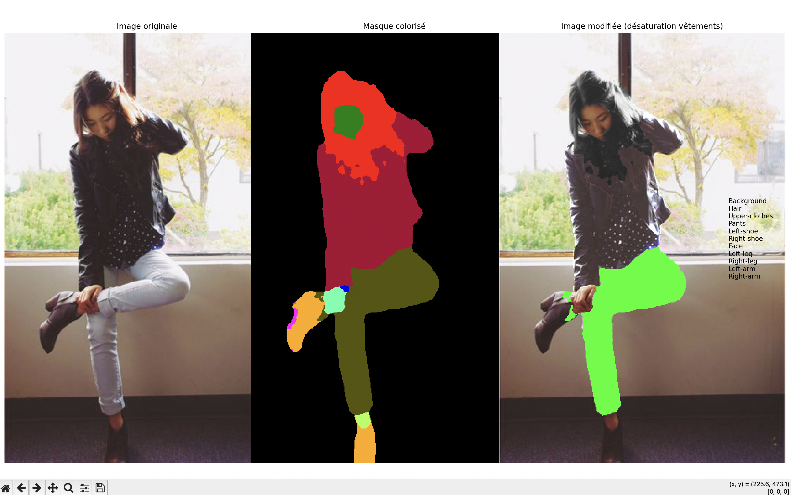

# Fashion Trend Intelligence

---

## Présentation du projet

Concevoir, développer et déployer un système d'analyse disposant des fonctionnalités suivantes :

- **Segmentation vestimentaire** : identification et d'isolement avec précision de chaque pièce vestimentaire dans une image.
- **Analyse stylistique** : classification des pièces selon leur nature, couleur, texture et style.
- **Agrégation de tendances** : compilation ces données sur des milliers de publications pour identifier les tendances émergentes.

---

## Fonctionnalité de segmentation

Pour cette fonctionnalité, la première étape est d'utiliser un modèle pré-entraîné capable d'identifier les différentes pièces vestimentaires dans une photo, comme illustré ci-dessous.



---

## Technologies utilisées

- Python 3
- API Hugging Face avec le modèle `sayeed99/segformer_b3_clothes`
- Bibliothèques : `Pillow`, `requests`, `matplotlib`, `numpy`

---

## Utilisation

1. Place tes images dans le dossier `assets/images`.
2. Défini ta variable d'environnement `HUGGINGFACE_API_TOKEN` avec ton token Hugging Face.
3. Lance le script :

```bash
python segmentation.py
